### 教程1.1:快速体验

这个教程是从头至尾快速地了解Anime Studio的主要功能,而不深 入它的细节。目的是浏览Anime Studio是怎样工作的,而不是教你 怎样使用某一特定功能。在这一教程中,我们将绘制和动画一个简 单的物体。

Anime Studio有若干编辑模式组成了其不同的工作任务。有些工具 用于生成新物体,其他用于修饰和动画现有的物体。Anime Studio 基础工具组有:绘图、填充、骨骼 、层、摄像机和工作空间。

这节教程介绍了一部分绘图、填充和层工具,而后面的教程将对这些工具组的各个工具分别进行详细地介绍。

### 绘制一个简单图形

双击Anime Studio图标启动Anime Studio,或者在开始菜单 (Windows)选择Anime Studio程序。当你新建了一个Anime Studio文件,它会出现如下画面:

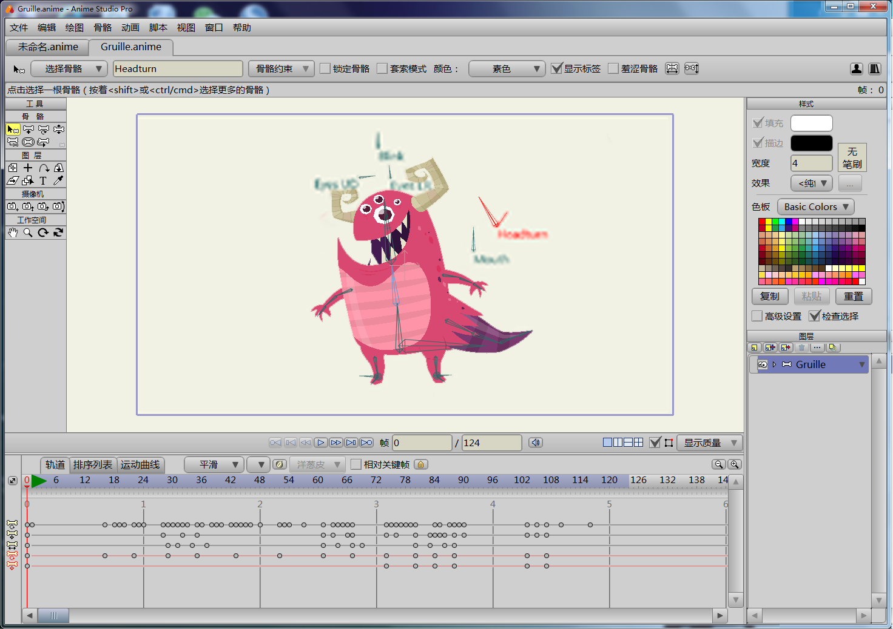

选择 文件->新建 创建一个新的工程,然后点击当前工具图标 (就在“文件”菜单的下面),选择 重置全部工具,这样可以使所有的工具恢复到默认值状态,以便你能够与这个教程同步。

点击工具栏里的“创建图形”工具选择它。

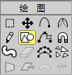

从创建图形工具选项栏里选择椭圆形工具。

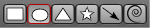

Anime Studio界面的右边的样式面板允许你为你绘制的图形选择填 充和轮廓颜色。要选择填充颜色,点击填充颜色框打开一个颜色选 择面板,从中选择你想填充的颜色,然后点击“确定”按钮。

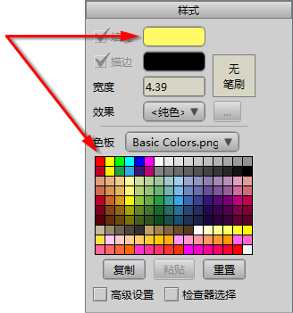

当你在工作空间的中心绘制时按着**Shift**键和**Alt**键创建一个圆形, 按住**Shift**键绘制一个正圆,而不是椭圆形;按着**Alt**键以你点击的 位置为圆心画圆。注意保持该圆形在蓝色的方框内部(这个蓝色的 矩形框表示你的作品的可视区域)。注意,如前面的插图那样,当 自动填充 选项被勾选,这个圆形将会自动填充颜色。

如果你不满意画出的圆形,从菜单栏中选编辑->撤销命令即可取消 操作。你的圆形看起来应该象如下所示:

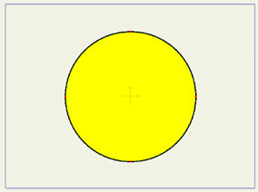

### 改变你的图形的颜色

如果你想改变填充颜色,从填充工具栏里选择颜料桶工具。勾选**填充**选项仅仅改变填充颜色;勾选**描边**选项仅仅改变笔触颜色;**两个选项**都勾选会同时按你在样式面板中选择的填充和描边颜色改变。

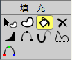

从样式面板中选择一个新的颜色,这和先前你选择颜色的方法类似。 然后在图形的内部点击去改变其颜色。

### 简单动画

当你在Anime Studio中做动画时,你可以在某一帧通过移动物体来 设定关键帧——在时间轴上的点,它表示一个物体的某一位置。在 时间轴上两个关键帧之间的内容,Anime Studio会自动计算物体的位置。

接近时间轴面板的顶部有一个标尺显示动画的帧数。点击帧标记上 的数字36将当前时间设在36帧上。

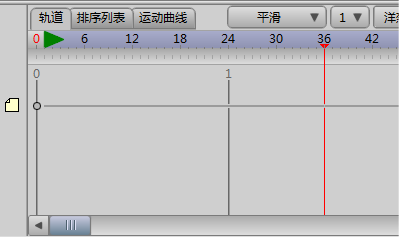

接下来从菜单栏中选择编辑->取消选择命令,在工具箱中点击操控 结点工具。

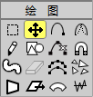

点击并向上拖动圆形底部的结点,把圆形扭曲成一个如下图的形
状:


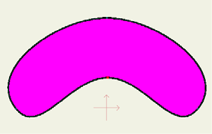


现在从工具栏中图层部分使用操控层工具去旋转这个层。


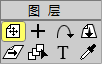


> 要用操控层工具旋转物体,在围绕着这个物体的两个矩形框边线之间点击并拖动。旋转这个物体到与下图相似的位置。


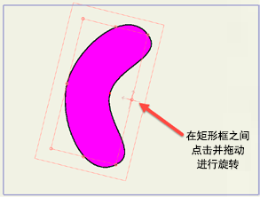


回到时间轴,在标尺上点击第72帧,将当前帧移动到第72帧。然后 从菜单条中选择绘图->重置全部结点命令,将所有的点恢复到它们 原来的位置。在主窗口的顶部的工具选项区中按下**重设**按钮将层恢 复到旋转以前的状态。


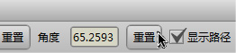


最后,我们将从默认的240帧缩短动画的长度。 在时间轴面板中, 在第二个文本框中输入80,这将动画的长度缩短到80帧。


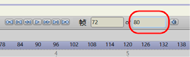



祝贺你,你已经完成了一个动画!点击主窗口底部附近的播放键来 观看动画。看完后,按下停止键。好,虽然你可能得不到任何电影 奖,但是你有了一个学习Anime Studio的好的开端。

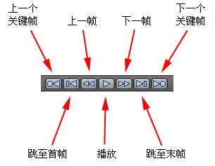

这是你完成的动画大概样子,按下**播放**按钮看看效果。

你已经知道Anime Studio的各种工具组可作不同的操作,甚至可以 使用其中几个工具。下面我们可以自己试着多做些什么,比如再增 加几个关键帧。如果你准备进一步学习,请看9页“[教程1.2:绘制 。简单的图形](drawing-simple-shapes.md)“。