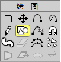
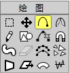

### 教程1.2:绘制简单的图形

在这课中你将学会怎样在Anime Studio中绘制简单的图形。下面的 教学将教你怎样绘制图形。

#### 生成一个背景

双击Anime Studio图标打开程序,或者,如果Anime Studio已经打 开,选择文件->新建生成一个新的工程文件。这个文件打开在一个 新的文件标签里。

点击当前工具图标(就在“文件”菜单下面),选择重置全部工具, 这会使所有工具回到它们的默认状态。


在这个工具面板中,点击创建图形工具激活它,然后选择矩形选项。



如下图所示,从样式面板为填充选择一个棕色。


在工作区域点击并拖曳生成如下所示的矩形:


我们要把这个长方形变成起伏的小山。到现在为止,这座小山看上 去过于平整,所以我们需要调整一下。在工具栏中选择增加点结工具。


在长方形的上面的边缘上点击并向上拖动鼠标。


你现在的图形应该看起来像下图那样。如果不满意,选择编辑->撤 销菜单并重新操作。注意一定要在长方形的上边缘上点击并向上拖曳鼠标。


让我们在稍右一点向下拖动为小山加上另一个曲线:


为了便于以后的操作,最好给这个图层取一个新的名字。在图层面板中双击这个层(目前只有一个层)。


在出现的对话框中输入“Hills”,然后点击“确定”按钮。


生成小山后,选择编辑->取消选择消除任何选择的结点,然后点击 工具箱填充栏目里的“选择图形”工具,点击你的小山的填充色。


样式面板将显示小山的设置:它的填充颜色,它的轮廓线宽度和颜色。要改变前面工程你使用的设置,点击**重置**按钮将填充色恢复到默认状态。


设置描边线条宽度为1, 然后从效果菜单中选择“颜色渐变”打开 “颜色渐变”对话框。


当你选择了“渐变”填充样式,Anime Studio会自动打开渐变设置 对话框,并自动为你选择“线性渐变”模式。


如果你以后想改变渐变设置,点击弹出菜单右边的详细设置样式按钮“⋯”。

要设置左边的渐变颜色,双击渐变条底部左边的颜色滑杆打开“颜色选择”对话框。选择一个绿色并点击“确定”按钮回到“渐变”对话框。

要设置右边的渐变颜色,双击渐变条底部右边的颜色滑杆打开“颜色选择”对话框。选择一个棕色并点击“确定”按钮回到“渐变”对话框。

当你的颜色选择完了,“渐变”设置应该如下图所示,点击“确定”按钮回到场景。


要看渐变的预览更容易,点击小山的外面取消对填充的选择,你将注意到一根线条一端带一个实心圆,它代表渐变的开始色(在我们的例子中是绿色),另一头的空心圆代表渐变的结束色(在我们的
例子中是棕色)。你可以调节这个颜色指标器去控制渐变的混合和方向。


在我们的例子中,渐变开始色是底部的棕色(空心圆点),结束色是小山顶部的绿色(实心圆点),如下图所示渐变的角度稍微倾向左上角。

从菜单栏中选择文件->存储为⋯ 命令,将这个工 程存储为“Tutorial 1.2”。

> 在16页的“[教程1.3:绘制复杂的图形](绘制复杂图形.md)” 中我们将继续 在这个场景中操作,加上更多的复杂物体。

